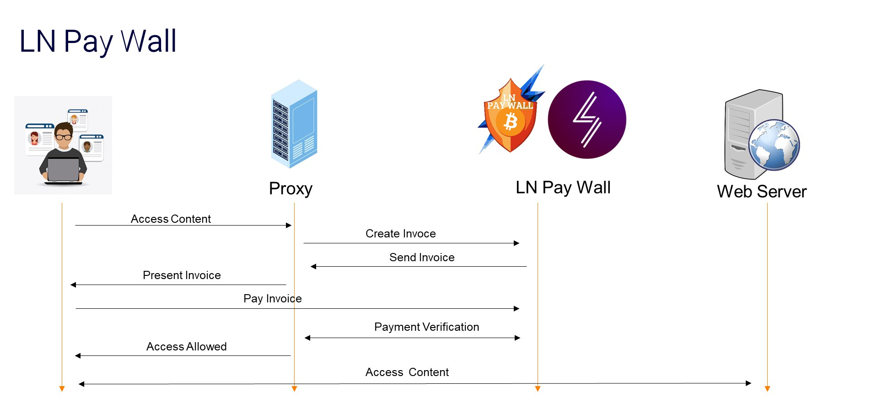

# LNPAYWALL

Adds a LN Paywall for any generic webservice.

**WATCH THE DEMO VIDEO**

https://github.com/uwla/lnpaywall/assets/47862859/5e2e5b5f-9764-48a4-88cc-f5f5d553f6ea

## How it works

The user has to pay some amount of money to use the service for a chosen period of time:

1. User selects for how long he wishes to access the service
2. User pays invoice
3. Payment is confirmed
4. User can access the requested webservice
5. After time expires, user has to go back to step 1.



## Advantages

It can be integrated with **ANY** webservice **WITHOUT CHANGES** to the service.

It just requires setting up the reverse-proxy to point to the machine hosting the webservice

The server providing the webservice is not aware of the proxy.

This separation of concerns frees the developer from the burden of setting up plugins, libraries and new APIs.

The simpler approach (currently) is to change 4 lines of code in docker-compose.yml to point to an existing container running the webservice.

## Local setup

### automated setup

The  script  `./setup-wizard.sh`  automates  the  process  of  configuring   the
`lnserver`, the `backend` and the `frontend`. Just run:

```bash
./setup-wizard.sh
```

It will prompt for values of  `environment`  variables,  then  will  create  the
`.env` files, bring up docker, and generate the backend's application key.

The only thing this script does not do is to set up Polar. For that, you have to
do it yourself.

### polar

Set up a local LN network using Polar, with at least two LND nodes.

### lnserver

Create `env` file at `lnserver/.env`:

```bash
cd lnserver/ && cp .env.sample .env
```

Here is a sample `.env` file:

```
PORT=8080
LND_SOCKET=polar-n1-alice:10009
LND_CERT=LS0tLS1CRUdJTiBDRVJHFHMWD0SHEF0gYF0gPx1WFHAXnxAQDJA5M0S3FHWOM0yEETMVFJ04q0cQn3SfqRczIRcWLxMAERSYDzqapJuenx9DHISRDJcOrR1FBUpXFSSMESMEHHgSrScmLz1EM1yLIwOvZzEfLz1JrIyLHzknD0WdJyuXZR1EAUqRDIyRIySEERI3IzuvE2kdJyEOMDcTqmO5GKcOAR1dL3yAISH1GKcPLHM3ZUyBERI3GJcSrH1HIGIArxWuGHESrRu6DJEPM05JDxSiIRMgrUInD0WbPzELHaMnZyM1JyuXnTEUIzgWE05fL25ErREdDH1PM05JDxSAIRWKEaAuI05fGHMeq0I3JHuYo1cWrzbjD0SEJHxXF29nFKcdZREOHJARHJqOEIcVpacLDmuLLKWiZHcxIIHmoUq6qJygH0kxD01nLzkDA2WDpJ5unRD2EyACFH42HNbiAzWcpx5BERSynaSloUymAGSAIyqvMwR3LzIDpGyCpJA1MwWnLH9PrSEQDaqdDH9PM05JFSR4DxSzBRIPDH1QPxSkHKqSq1yRIyVjoRWOq3qQM1yWF3qMDxWEIHuOq0I3EUqMESMFZSEOHHtiDxSIq0S3EHVirxSxDzqBIxuEARHXEzqEIISXAPgcZmqbDJpeMJq1o3OInHqGZzA6JGt3L3quq1yRIyVjHxWUHKqMo0yTJIq4pSxlI0AQI3u2JGWTpjcuEmy6MRyWEyyKrUOMZyqQET5PqzWUEayZImE4GSqTp2SKGzkaM1VkLz1fATqapQSvoJj0L0qTnzRlIwOaM2EcPzEKJzcvZwI1nUqFY0SODHWbrRSODHSODHSODHSODHSODHSODHSODHWbq1AmEJqOF01Oo0qQD3SUH000BHWOGHZXDGOaDH1SIHAWHHEFMxt2X1yzA1W3Ixf1M1OkpT1zGGyWLwp0MHqVA3AepIqmY2yCHTWkpaI3FJqDqzyPFIulAtc1rTMHpx1eMayQnUEVARWfAwEaBScELJ5coKbjnv9SGQueEG0XYF0gYF1SGxDtD0IFIRyTFHAOIRHgYF0gYDb=
LND_MACAROON=AgEDbG5kAvgBAwoQGkwzLBtFQM9tRtaC1EOmYuVOZObJPtquMTElMKAmRtElMJSxRtI3pzy0MEbGPtEcozMiRtElMJSxRtI3pzy0MEbKPtucoaMinJAypkVRpzIuMOVSq3WcqTHnVDbVoJSwLKWio24FPTqyozIlLKEyRtElMJSxRtI3pzy0MEbJPtqgMKAmLJqyRtElMJSxRtI3pzy0MEbKPtuiMzMwnTScouVRpzIuMOVSq3WcqTHnStbUo25wnTScouVRpzIuMOVSq3WcqTHnSNbSpTIypaZFOUWyLJDFOKqlnKEyTutXOaAcM25ypuVVM2IhMKWuqTHFOUWyLJDNNNLtRGnSLKkTVd5emXh/2WdtBoe2hYoG6/bRc2vbonlabOp=
```

You need to replace it with the proper values.

In the example above, we set `LND_SOCKET` to `polar-n1-alice:10009` because this
is the default name for the container created by `Polar`.

### backend

Create the `.env` file:


```bash
cd backend/ && cp .env.example .env
```

There is nothing you need to edit in the `.env` file.

However, we need the `.env` file to store the application's key to encrypt sessions.

After copying creating the `.env` file, generate the application's key:

```bash
php artisan key:generate
```

You will only be able to run the command above if `php` is installed and if  the
backend dependencies are present in `vendor/`.

If you do not have `php` installed, you can bring the containers up first, and after
the contaienr is running you shall run this command:

```bash
docker container exec -u 1000 lnpaywall-backend-1 php artisan key:generate
```

The `lnpaywall-backend-1` is the expected container name for the backend container.

The `-u 1000` flag tells docker to run the command with uuid 1000 and not as the
root user (which is the default); otherwise it could assign root permissions  to
the `.env`.

### frontend

The frontend can be any webservice running on a docker container.

The frontend container must be attached to an external network, so the paywall
container can connect to it.

Here is an example of how to setup the frontend container:

```bash
docker network create frontendnet
mkdir website && echo "hello world!" > website/hello.txt
docker container run -d --name frontend --network frontendnet -v ./website:/app:ro evop/static_webserver
```

**Summary** of the above: First, we create the network. Then, we create a  basic
static website. Finally we run a docker container in detached mode connected  to
the network we defined earlier and map  the  website  to  the  default  location
expected by the container image.

### docker

Copy `.env.sample` to `.env`:

```bash
cp .env.sample .env
```

Adjust the values if needed:

```
LN_NETWORK=polar-network-1_default
FRONTEND=http://frontend_container:8080
FRONTEND_NETWORK=frontend_network
```

Where:

- `LN_NETWORK`: the name of the Docker network used by Polar.
- `FRONTEND`: protocol + hostname/IP + port of an existing docker container
- `FRONTEND_NETWORK`: a docker network attached to the frontend container

After that, bring the containers up:

```bash
docker-compose up -d
```

## Tech stack

- nginx (reverse proxy)
- typescript + nodejs (REST server for lightning queries)
- laravel (backend for handling user session)
- docker (container technology)
- polar (simulate a local LN network)

## Notes

Currently, this is a proof-of-concept only.

## LICENSE

MIT.

